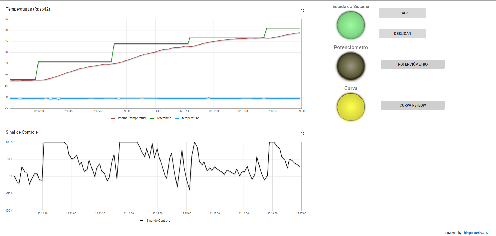
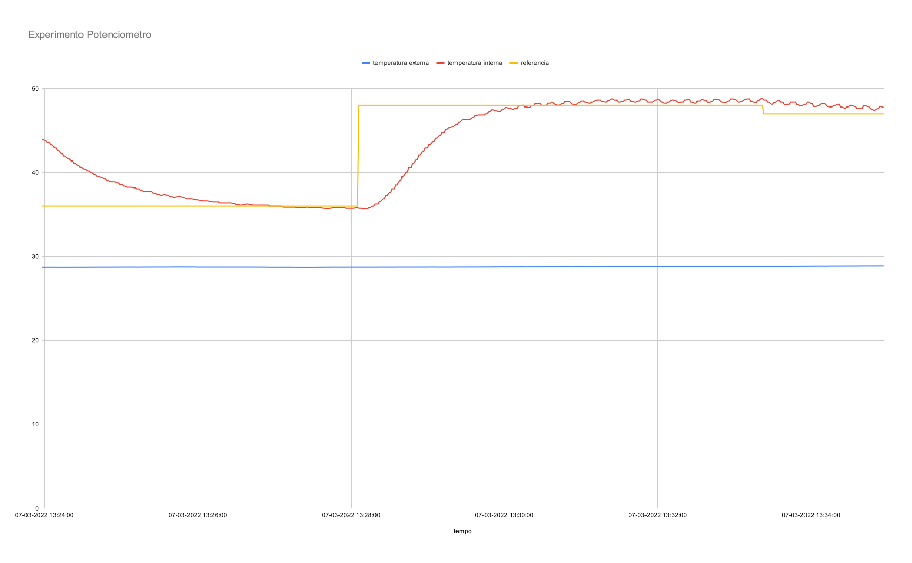
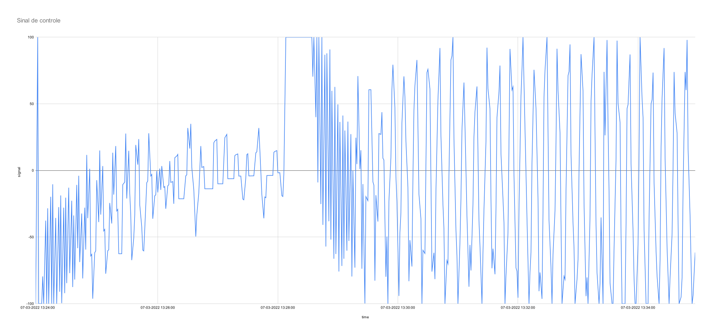
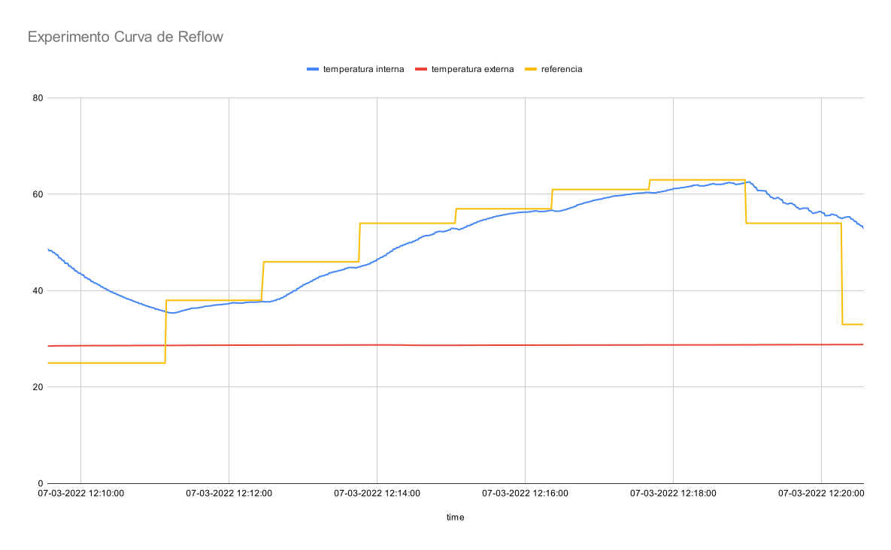
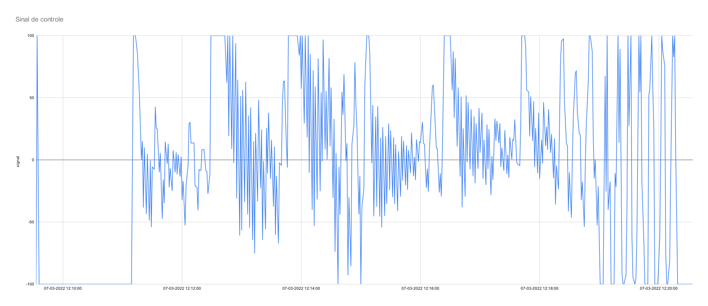

# FSE-Trabalho-1

Trabalho 1 da disciplina de Fundamentos de Sistemas Embarcados (2021/2)

<p align="center">
  
</p>

## Objetivo

Este trabalho tem por objetivo a implementação de um sistema (que simula) o controle de um forno para soldagem de placas de circuito impresso (PCBs). O software efetua o controle de temperatura do forno utilizando dois atuadores p: um resistor de potência de 15 Watts para aumentar temperatura e; uma ventoinha que puxa o ar externo para reduzir a temperatura do sistema.

## Execução

Para executar o projeto na rasp execute os seguintes comandos:

#### 1. Clone o repositório

```
git clone https://github.com/EduardoPicolo/FSE-Trabalho-1.git
cd FSE-Trabalho-1
```

#### 2. Compile o projeto

```
make
```

#### 2. Execute

```
make run
```

## Como usar

O usuario pode escolher os Parâmetros de PID ao iniciar o programa. Para isso, basta digitar o número correspondente aos parâmetros predefinidos recomendados, sendo que a terceira opção permite ajustar os parâmetros livremente.

Os comandos do usuário do sistema para definir a temperatura desejada serão controlados de três maneiras:

- Através de um Potenciômetro externo
- Seguindo uma curva de temperatura pré-definida em arquivo de configuração
- Através de entrada de teclado no terminal

No modo terminal será solicitado a temperatura desejada e o sistema irá atuar de acordo com o valor informado.

Ao selecionar o modo Potenciômetro o sistema irá atuar de acordo com o valor do potenciômetro externo via UART.

No modo Curva Reflow o sistema irá atuar de acordo com a curva de temperatura pré-definida em arquivo de configuração.

## Experimento Potenciômetro

<p align="center">
  
</p>

<p align="center">
  
</p>

## Experimento Curva de Reflow

<p align="center">
  
</p>

<p align="center">
  
</p>
